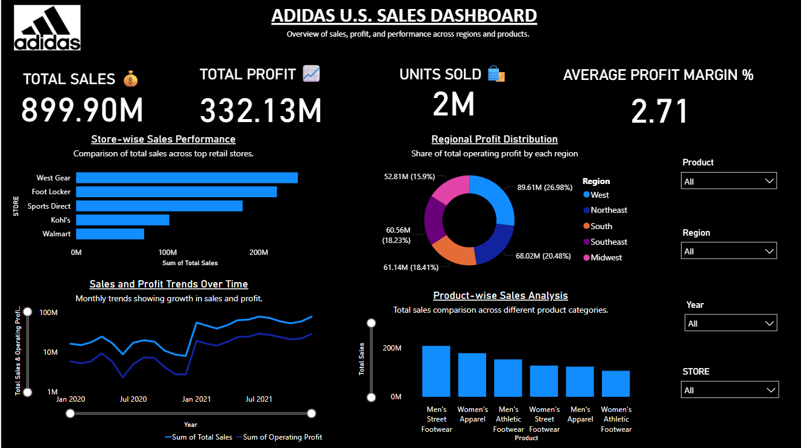
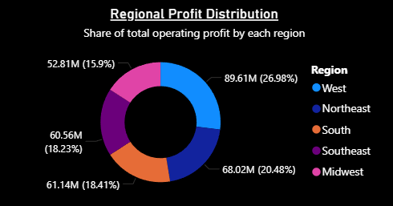
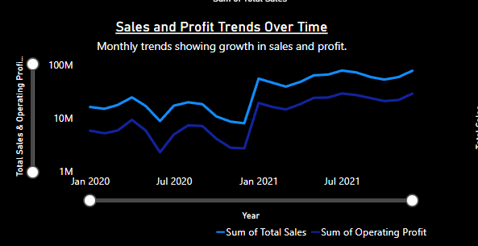

# Adidas U.S. Sales Dashboard

This Power BI dashboard provides a comprehensive analysis of Adidas' U.S. sales performance. It highlights revenue trends, profit contribution, product-wise analysis, store-level sales, and regional growth patterns, helping stakeholders make data-driven business decisions.
---
## 📊 Dashboard Overview

This overview displays the complete visual representation of Adidas’ sales insights, including KPIs, product performance, trends, and filters for detailed analysis.
---
## 🧾 Key Performance Indicators (KPIs)

**Insights:**
- **Total Sales:** $899.90M reflects a strong market demand.
- **Total Profit:** $332.13M indicates efficient pricing and operational control.
- **Units Sold:** 2M products sold across categories.
- **Average Profit Margin:** 2.71% showing moderate profit efficiency.
---
## 🏪 Store-wise Sales Performance

**Insight:**  
Among all listed retailers, **West Gear** and **Foot Locker** generated the highest sales, showing strong brand presence and retail partnerships. Kohl’s and Walmart reflect lower performance, indicating areas for potential improvement.
---
## 🌎 Regional Profit Distribution

**Insight:**  
The **West region** contributes the highest profit at **26.98%**, followed by the **Southeast** and **South**. These regions present strong potential for further expansion. The **Midwest** has the lowest contribution, suggesting opportunity for marketing and distribution strategies.
---
## 📈 Sales and Profit Trends Over Time

**Insight:**  
Sales and profit show a consistent upward movement from 2020 to 2021, highlighting Adidas’ increasing brand penetration and customer demand. Temporary dips suggest seasonal or supply-chain variations.
---
## 👟 Product-wise Sales Analysis

**Insight:**  
**Men’s Street Footwear** and **Women’s Apparel** are top-selling categories. Consistent demand for streetwear indicates a strong consumer trend. **Women’s Athletic Footwear** shows growth potential for targeted marketing.
---
## 🛠 Tools Used
- **Power BI Desktop** – Data modeling & dashboard creation  
- **Excel / CSV Dataset** – Raw data source  
- **DAX Measures** – KPI calculations and analysis  
---
## 🏁 Conclusion
This dashboard provides actionable insights on Adidas’ U.S. sales ecosystem. Store and regional performance indicate where the company performs well and where improvement opportunities exist. Product category comparison shows evolving customer preferences, helping guide strategic decision-making in marketing, supply chain, and inventory management.
---

### 📌 Repository Structure

